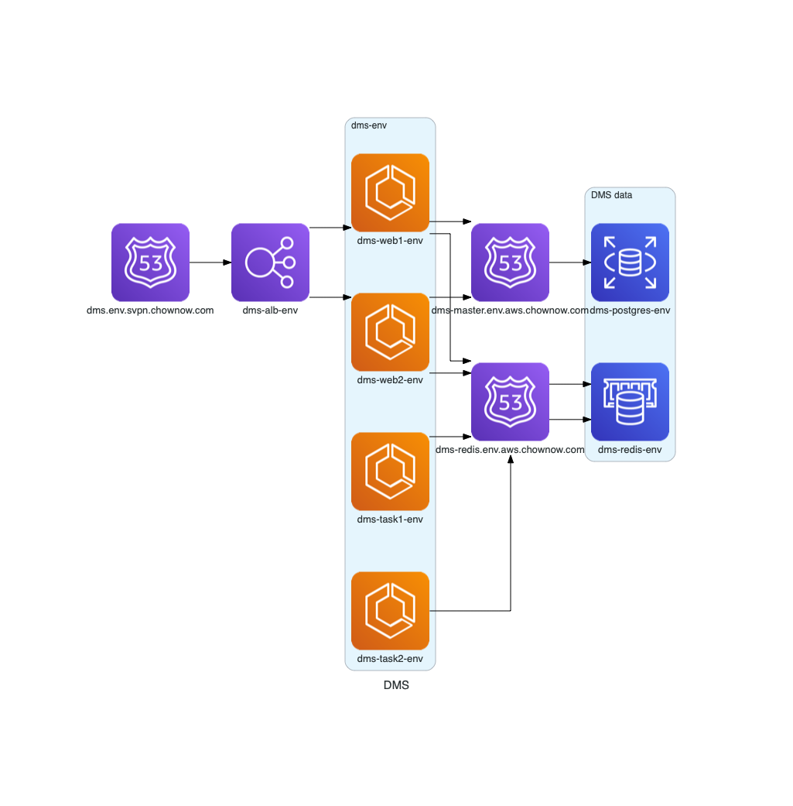
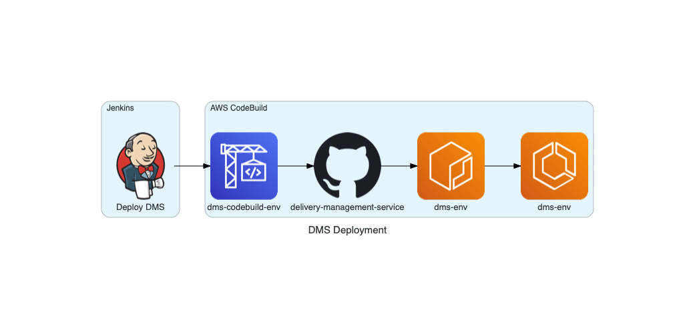

# DMS

### General

* Description: DMS (Delivery Management Service) Terraform Module
* Created By: Joe Perez
* Module Dependencies:
  * `core-base`
  * `region-base`
  * `global-base`
* Provider Dependencies: `aws`, `template`, `random`
* Terraform Version: 0.14.11


#### DMS Architecture


### DMS Deployment


### Usage

* Terraform basic:

```hcl
module "dms_base" {
  source = "git::git@github.com:ChowNow/ops-tf-modules.git//modules/chownow/services/dms?ref=chownow-dms-app-v2.0.0"

  env             = "ncp"
  vpc_name_prefix = "main"
}
```

* Terraform basic example using the default vpc prefix "nc" and specifying the wildcard prefix because it's not uniform in all existing environments.

```hcl
module "dms_app" {
  source = "git::git@github.com:ChowNow/ops-tf-modules.git//modules/chownow/services/dms/app?ref=chownow-dms-app-v2.0.0"

  env                    = var.env
  wildcard_domain_prefix = "*."
}
```


### Initialization

### Terraform

* Run the DMS `base` module to create the secrets
  * eg directory structure
```
stg/
├── global
└── us-east-1
    ├── core
    ├── db
    └── services
        └── dms
            ├── app
            └── base
                ├── dms_base.tf
                ├── provider.tf
                └── variables.tf
```

  * `dms_base.tf`
```hcl
module "dms_base" {
  source = "git::git@github.com:ChowNow/ops-tf-modules.git//modules/chownow/services/dms/base?ref=chownow-dms-base-v2.0.0"

  env = var.env
}
```

* Update the API keys and secrets in AWS Secrets Manager and store them in 1PW
* Run the db modules to create redis instance and postgresql database (RDS)
  * eg directory structure

```
stg/
├── global
└── us-east-1
    ├── core
    └── db
        └── dms
            ├── dms_db.tf
            ├── dms_redis.tf
            ├── provider.tf
            └── variables.tf

```

  * `dms_db.tf`

```hcl
module "dms_db_pg" {
  source = "git::git@github.com:ChowNow/ops-tf-modules.git//modules/aws/rds/postgresql?ref=rds-pg-v2.0.0"

  env             = var.env
  service         = var.service
  vpc_name_prefix = "nc"
}
```
* `dms_redis.tf`

```hcl
module "dms_db_redis" {
  source = "git::git@github.com:ChowNow/ops-tf-modules.git//modules/aws/elasticache/redis?ref=aws-elasticache-redis-v2.0.0"

  env             = var.env
  service         = var.service
  vpc_name_prefix = "nc"
}
```

* Run the DMS app module to create ECS/ECR/ALB/etc
  * eg directory structure

```hcl
stg/
├── global
└── us-east-1
    ├── core
    ├── db
    └── services
        └── dms
            └── app
                ├── dms_app.tf
                ├── provider.tf
                └── variables.tf
```
* `dms_app.tf`

```hcl
module "dms_app" {
  source = "git::git@github.com:ChowNow/ops-tf-modules.git//modules/chownow/services/dms/app?ref=chownow-dms-app-v2.0.0"

  env                    = var.env
  wildcard_domain_prefix = "*."
}
```


### Jenkins

* Deploy DMS to environment in [Jenkins](https://jenkins.ops.svpn.chownow.com/job/Deployment/job/Deploy%20Dms/)

### Provisioning monitoring

* Start a [saw](https://github.com/TylerBrock/saw) tail: `aws-vault exec ENV -- saw watch dms-log-group-ENV`
  * This will allow to you see the CloudWatch output without having to log into the aws console

### Database

#### Automated
* Get Subnet ID: `aws ec2 describe-subnets --filters "Name=tag:NetworkType,Values=private" "Name=tag:VPC,Values=${vpc_name}" --query 'Subnets[0].{ID:SubnetId}' --output text`
* Initialize database:

```
aws-vault exec ENV -- aws ecs run-task --task-definition dms-web-ENV \
--cluster dms-ENV --launch-type FARGATE \
--overrides '{"containerOverrides":[{ "name":"dms-ENV", "command":["ash", "/code/scripts/db-init.sh"], "environment":[{"name":"PGMASTER_PASSWORD","value":"REDACTED"}] }]}' --network-configuration awsvpcConfiguration={subnets=[subnet-12345677889576856]}
```

#### Manual
* Run these commands from a host that can connect to the database:
*  Create the user: `createuser -h dms-master.ENV.aws.chownow.com -U root -W -dPE dms`
   *  Use the `/env/dms/pgmaster_password` in AWS Secrets Manager as the `root` user password
   *  Use the `/env/dms/postgres_password` in AWS Secrets Manager
*  Create the database: `createdb -h dms-master.uat.aws.chownow.com -U dms -W dms`
*  Add the postgis extension: `psql -U root -W -h dms-master.uat.aws.chownow.com -c "CREATE EXTENSION IF NOT EXISTS postgis;" dms`

#### ECS task

* Get Subnet ID: `aws ec2 describe-subnets --filters "Name=tag:NetworkType,Values=private" "Name=tag:VPC,Values=${vpc_name}" --query 'Subnets[0].{ID:SubnetId}' --output text`

* Run manage task in specific env:
```
aws-vault exec ENV -- aws ecs run-task \
  --task-definition dms-manage-ENV \
  --cluster dms-ENV \
  --launch-type FARGATE \
  --network-configuration awsvpcConfiguration={subnets=[subnet-PRIVATESUBNETIDGOESHERE]}
```
* Load data:
```
aws-vault exec ENV -- aws ecs run-task \
  --task-definition dms-manage-ENV \
  --cluster dms-ENV \
  --launch-type FARGATE \
  --overrides '{"containerOverrides":[{"name":"dms-manage","command":["loaddata","providers.json"]}]}' \
  --network-configuration awsvpcConfiguration={subnets=[subnet-PRIVATESUBNETIDGOESHERE]}
```
* Create admin user:
```
aws-vault exec ENV -- aws ecs run-task \
  --task-definition dms-manage-ENV \
  --cluster dms-ENV \
  --launch-type FARGATE \
  --overrides '{"containerOverrides":[{"name":"dms-manage","command":["loaddata","user.json"]}]}' \
  --network-configuration awsvpcConfiguration={subnets=[subnet-PRIVATESUBNETIDGOESHERE]}
```
* CHANGE PASSWORD IN WEB INTERFACE AFTER ADDING THE USER AND ADD THE NEW CREDENTIALS TO 1PASSWORD!

  * ALTERNATE: Manual admin user creation via psql:

```
insert into base_user
(password , last_login , is_superuser , username , first_name , last_name , email , is_staff , is_active , date_joined , is_api_user)
values
('pbkdf2_sha256$150000$HEsOWGbSTbiG$D9itWg6C3v66RhOaF2M9pTTh26Ui2wlctKwqGsIvqSc=', null, true, 'admin', '', '', '', true, true, now(), false);
```

* Test logging into DMS via `https://dms.ENV.aws.chownow.com/admin` (1PW: _DMS - Default admin login_)
* You can also check the health via `https://dms.ENV.aws.chownow.com/health`


* Set log retention on Container Insights because you cannot set it via Terraform:
  - `aws-vault exec ENV -- aws logs put-retention-policy --log-group-name "/aws/ecs/containerinsights/dms-ENV/performance" --retention-in-days 90`

### Options

* Description: Input variable options and Outputs for other modules to consume

#### Inputs

| Variable Name              | Description                                        | Options                         | Type     | Required? | Notes |
| :------------------------- | :------------------------------------------------- | :------------------------------ | :------: | :-------: | :---- |
| container_port             | ECS container port                                 | TCP port                        | string   |  No       | N/A   |
| env                        | unique environment/stage name                      | sandbox/dev/qa/uat/stg/prod/etc | string   |  Yes      | N/A   |
| service                    | name of ECS service                                | default: dms                    | string   |  No       | N/A   |
| web_scaling_min_capacity   | web container minimum count managed by autoscaling | (default:4)                     | int      |  No       | N/A   |
| web_scaling_max_capacity   | web container maximum count managed by autoscaling | (default:10)                    | int      |  No       | N/A   |

#### Outputs

| Variable Name      | Description         | Type    | Notes |
| :----------------- | :------------------ | :-----: | :---- |


### Lessons Learned
* Maybe the ALB should be live in the DMS base module. It's probably more long-lived than the ecs stuff and will be one less thing to be reprovisioned.
* Or maybe the ALB should be more generalized and several ECS based apps should attach to it
* Changing target groups can be issues because of the dependencies on it from listener rules :/

### References

* [chownow-delivery-management-service repo](https://github.com/ChowNow/chownow-delivery-management-service/tree/master/dms)
* [Saw cloudwatch tail tool](https://github.com/TylerBrock/saw)
* [DMS provisioning/deployment workbook](https://chownow.atlassian.net/wiki/spaces/CE/pages/935002333/DMS+Provisioning+Deployment)
