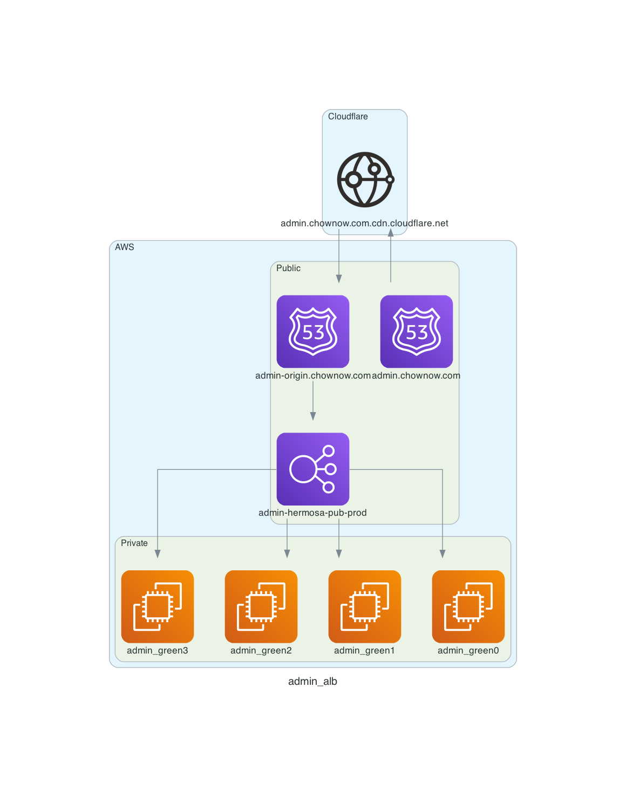

<!-- BEGIN_TF_DOCS -->
# Hermosa Base Module

### General

* Description: Hermosa base terraform module. This module creates the admin/web ALBs and other resources which are required before creating the hermosa application and database
* Created By: Joe Perez
* Module Dependencies: `alb-public`, `alb-listener`, `alb-listener-rule` `alb-target-group`, `cloudflare-sg`
* Module Components:
  * `admin alb`
  * `admin target group(s)`
  * `admin listener rules`
  * `web alb`
  * `web target group`
  * `web listener rules`
  * `web route53 cnames`
  * `hermosa s3 buckets`
  * `hermosa security group for VPC`
* Providers : `aws`, `random`
* Terraform Version: 0.14.x


#### Admin ALB Architecture


#### Web ALB Architecture

_Note: `api.chownow.com` is used in the example, but this is the same setup for other hermosa web subdomains (`eat`, `facebook`, `ordering`, etc)_

_Note: In lower environments, the DNS zone will be `{ENV}.svpn.chownow.com`_

## Usage

* Terraform:

```hcl
module "hermosa_base" {
  source = "git::git@github.com:ChowNow/ops-tf-modules.git//modules/chownow/services/hermosa/base?ref=cn-hermosa-base-v2.3.5"

  env                 = "uat"
  isolated_useragents = ["cloudkitchens", "CubohBot/*", "OrderRobot/*" ]
}

# Terraform (alternate):
module "hermosa_base" {
  source = "git::git@github.com:ChowNow/ops-tf-modules.git//modules/chownow/services/hermosa/base?ref=cn-hermosa-base-v2.3.5"

  env                 = "uat"
  isolated_useragents = ["cloudkitchens", "CubohBot/*", "OrderRobot/*"]

  # Disable web ALB
  enable_alb_web = 0

  # Disable hermosa buckets
  enable_bucket_facebook        = 0
  enable_bucket_google_datafeed = 0
  enable_bucket_merchant        = 0
  enable_bucket_onboarding      = 0
  enable_bucket_single_platform = 0
  enable_bucket_static_assets   = 0
}
```

## Module options

* Description: Input variable options and Outputs for other modules to consume

## Inputs

| Name | Description | Type | Default | Required |
|------|-------------|------|---------|:--------:|
| admin\_cname\_alb | cname subdomain in chownow zone for admin | `string` | `"admin-origin"` | no |
| admin\_cname\_cloudflare | cname subdomain to use for admin | `string` | `"admin"` | no |
| admin\_healthcheck\_target | health check path for admin ALB | `string` | `"/statuscode/200"` | no |
| admin\_listener\_rule\_priority | listener rule priority for first admin listener rule | `number` | `10` | no |
| ar\_lr\_action\_type | admin redirect listener rule action type | `string` | `"redirect"` | no |
| ar\_path\_destination | admin redirect path destination | `string` | `"/#{path}"` | no |
| ar\_query | admin redirect query | `string` | `"#{query}"` | no |
| ar\_target\_group\_arn | admin redirect target group ARN | `string` | `"null"` | no |
| audit\_bucket\_name | Custom name for audit archive bucket | `string` | `""` | no |
| bucket\_name\_prefix | s3 bucket name prefix | `string` | `"cn-"` | no |
| cdn\_cnames | n/a | `list` | `[]` | no |
| cloudflare\_domain | cloudflare domain to be appended to the end of cname desination | `string` | `"cdn.cloudflare.net"` | no |
| custom\_cert\_chownowcdn\_domain | customizable SSL cert chownowcdn domain name | `string` | `""` | no |
| custom\_chownowcdn\_zone | customizable chownowcdn zone name | `string` | `""` | no |
| custom\_username | custom name for hermosa IAM user | `string` | `""` | no |
| custom\_username\_path | custom path for hermosa IAM user | `string` | `""` | no |
| custom\_vpc\_name | override for vpc to use for resource placement | `string` | `""` | no |
| domain | domain name to use for resource creation | `string` | `"chownow.com"` | no |
| enable\_alb\_admin | enables/disables admin alb creation | `number` | `1` | no |
| enable\_alb\_web | enables/disables web alb creation | `number` | `1` | no |
| enable\_alb\_webhookproxy | enables/disables web alb creation | `number` | `0` | no |
| enable\_bucket\_audit | enable/disable bucket creation | `number` | `1` | no |
| enable\_bucket\_facebook | enable/disable bucket creation | `number` | `1` | no |
| enable\_bucket\_google\_datafeed | enable/disable bucket creation | `number` | `1` | no |
| enable\_bucket\_menu | enable/disable menu s3 bucket lookup | `number` | `0` | no |
| enable\_bucket\_merchant | enable/disable bucket creation | `number` | `1` | no |
| enable\_bucket\_onboarding | enable/disable bucket creation | `number` | `1` | no |
| enable\_bucket\_single\_platform | enable/disable bucket creation | `number` | `1` | no |
| enable\_bucket\_static\_assets | enable/disable bucket creation | `number` | `1` | no |
| enable\_cloudflare | enables/disables cloudflare records creation | `number` | `1` | no |
| enable\_cloudfront\_distribution | enable creation of cdn distribution for static assets | `number` | `1` | no |
| enable\_eat | enables/disables eat. related resources | `number` | `1` | no |
| enable\_gdpr\_cname\_cloudflare | enables/disables cloudflare gdpr cname | `number` | `1` | no |
| enable\_gdpr\_cname\_eat | a way to enable/disable creation of GDPR cname for eat | `number` | `1` | no |
| enable\_gdpr\_cname\_facebook | a way to enable/disable creation of GDPR cname for facebook | `number` | `1` | no |
| enable\_gdpr\_cname\_ordering | a way to enable/disable creation of GDPR cname for ordering | `number` | `1` | no |
| enable\_http\_to\_https\_redirect | enable/disable https redirect | `number` | `1` | no |
| enable\_iam\_user | option to create hermosa service user | `number` | `1` | no |
| enable\_vpce | enable/disable S3 vpce | `number` | `1` | no |
| env | unique environment/stage name a | `any` | n/a | yes |
| env\_inst | environment instance, eg 01 added to stg01 | `string` | `""` | no |
| extra\_tags | optional addition for tags | `map` | `{}` | no |
| facebook\_bucket\_name | Custom name for the facebook bucket | `string` | `""` | no |
| geo\_target | n/a | `string` | `"*"` | no |
| google\_datafeed\_bucket\_name | Name of the google datafeed bucket | `string` | `""` | no |
| health\_check\_target | The target to check for the load balancer. | `string` | `"/statuscode/200"` | no |
| isolated\_useragents | list of user agents to route to the bot pool | `list` | `[]` | no |
| menu\_bucket\_name | Name of the Menu S3 bucket | `string` | `""` | no |
| merchant\_bucket\_name | Custom name for merchant bucket | `string` | `""` | no |
| name\_prefix | name prefix | `string` | `"cn"` | no |
| onboarding\_bucket\_name | Name of the onboarding S3 bucket | `string` | `""` | no |
| price\_class | n/a | `string` | `"PriceClass_100"` | no |
| service | unique service name | `string` | `"hermosa"` | no |
| set\_id | n/a | `string` | `"Default"` | no |
| single\_platform\_bucket\_name | Custom name for single platform bucket | `string` | `""` | no |
| static\_assets\_bucket\_name | Name of the static assets S3 bucket | `string` | `""` | no |
| subdomain\_api | api subdomain for route53 record creation | `string` | `"api"` | no |
| subdomain\_eat | eat subdomian for route53 record creation | `string` | `"eat"` | no |
| subdomain\_facebook | facebook subdomian for route53 record creation | `string` | `"facebook"` | no |
| subdomain\_ordering | ordering subdomian for route53 record creation | `string` | `"ordering"` | no |
| subdomain\_webhookproxy | webhookproxy subdomain for route53 record creation | `string` | `"webhookproxy"` | no |
| svpn\_subdomain | subdomain name to use for resource creation | `string` | `"svpn"` | no |
| tag\_managed\_by | what created resource to keep track of non-IaC modifications | `string` | `"Terraform"` | no |
| ttl\_api | api cname record ttl | `number` | `60` | no |
| ttl\_eat | eat cname record ttl | `number` | `60` | no |
| ttl\_facebook | facebook cname record ttl | `number` | `60` | no |
| ttl\_ordering | ordering cname record ttl | `number` | `60` | no |
| ttl\_webhookproxy | webhookproxy cname record ttl | `number` | `60` | no |
| vpc\_name\_prefix | name prefix to use for VPC | `string` | `"main"` | no |
| vpc\_name\_prefix\_main | The Main VPC's name prefix, eg. main in main-dev | `string` | `"main"` | no |
| vpn\_subnets | n/a | `list` | ```[ "54.183.225.53/32", "54.183.68.210/32", "52.21.177.104/32", "34.224.187.148/32", "52.6.18.116/32", "54.227.163.228/32" ]``` | no |
| web\_cname\_alb | cname subdomain in chownow zone for web | `string` | `"web-origin"` | no |
| web\_cname\_cloudflare | cname subdomain to use for web | `string` | `"web"` | no |
| web\_healthcheck\_target | health check path for web ALB | `string` | `"/statuscode/200"` | no |
| webhookproxy\_cname\_cloudflare | cname subdomain to use for webhookproxy | `string` | `"webhookproxy"` | no |
| wildcard\_domain\_prefix | allows for the addition of wildcard to the name because some chownow accounts have it | `string` | `""` | no |


### Lessons Learned

* This model of building out ALB resources (listener/listener rules) seems like a good way to keep the environments with cloudflare in sync.
* There are still some manual steps in Cloudflare that need to be completed for new subdomains to be added:
  * The subdomain to web-origin cname
  * Firewall allow rule based on subdomain regex
  * Page rule to force HTTPS


### References

---

<sub>Generated with [terraform-docs](https://terraform-docs.io/) using `ops-tf-modules/.tfdocs.d/.terraform-docs.yml`<sub>
<!-- END_TF_DOCS -->
