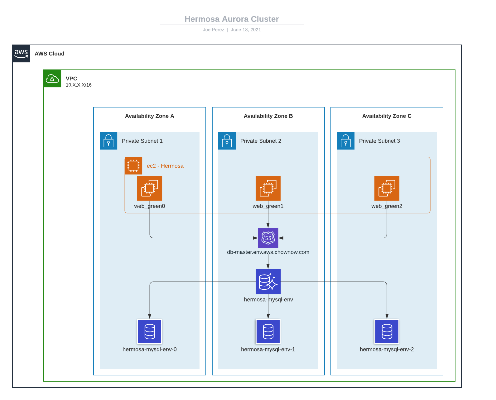

<!-- BEGIN_TF_DOCS -->
# Hermosa DB Module

### General

* Description: Hermosa DB terraform module. This module creates the aurora cluster for hermosa
* Created By: Joe Perez
* Module Dependencies:
* Module Components:
  * `random password`
  * `aws secret`
  * `aurora cluster`
  * `aurora database instance`
  * `aurora endpoint cnames`
* Providers : `aws`, `random`
* Terraform Version: 0.14.x



_Note: Not pictured is the aurora reader endpoint cname which follows the pattern `db-replica.env.aws.chownow.com`_

### Versions

* *cn-hermosa-db-v2.1.0*
  * this version is to be used just before upgrading a cluster from 5.6 to 5.7
* *cn-hermosa-db-v2.1.1*
  * this version is to be used right after upgrading a cluster from 5.6 to 5.7
  * remove the current cluster from the TF state (terraform state rm)
  * import the upgraded 5.7 cluster into terraform (terraform import)
  * replan and apply

### Initialization

### Terraform

* Example directory structure:
```
.
├── global
└── us-east-1
    ├── core
    └── db
        └── hermosa
            └── mysql
              ├── hermosa_db.tf
              ├── provider.tf
              └── variables.tf
```

## Usage

* Terraform:

```hcl
# Terraform (basic):
module "hermosa_db" {
  source = "git::git@github.com:ChowNow/ops-tf-modules.git//modules/chownow/services/hermosa/db?ref=cn-hermosa-db-v2.2.1"
  env    = "uat"
}

# Terraform (alternate):
module "db" {
  source                          = "git::git@github.com:ChowNow/ops-tf-modules.git//modules/chownow/services/hermosa/db?ref=cn-hermosa-db-v2.2.1"
  env                             = var.env
  db_instance_class               = "db.r5.4xlarge"
  enable_cloudwatch_logs          = 1
  db_backup_retention_period      = 30
  db_performance_insights_enabled = true
  db_snapshot_identifier          = "arn:aws:rds:us-east-1:1234567890:snapshot:db-snapshot-20210611"
  extra_security_groups           = ["sg-09e4a6fc3243436cd"]
  menu_s3_bucket_name             = "menu-rds-data-migration-qa"
}
```

## Module options

* Description: Input variable options and Outputs for other modules to consume

## Inputs

| Name | Description | Type | Default | Required |
|------|-------------|------|---------|:--------:|
| count\_cluster\_instances | the number of database instances to create in the cluster | `number` | `2` | no |
| custom\_cluster\_identifier | custom cluster identifier | `string` | `""` | no |
| custom\_name | custom name | `string` | `""` | no |
| custom\_vpc\_name | vpc override for resource placement | `string` | `""` | no |
| db\_allow\_major\_version\_upgrade | allow major db version upgrade | `bool` | `false` | no |
| db\_apply\_immediately | boolean to allow changes to be applied immediately | `bool` | `false` | no |
| db\_backup\_retention\_period | database backup retention period | `number` | `1` | no |
| db\_cname\_endpoint | subdomain to use for database endpoint | `string` | `"db-master"` | no |
| db\_cname\_endpoint\_reader | subdomain to use for database endpoint | `string` | `"db-replica"` | no |
| db\_database\_name | database name inside of Aurora cluster | `string` | `"hermosa"` | no |
| db\_engine | Specifies the name of the engine | `string` | `"aurora-mysql"` | no |
| db\_engine\_name | Specifies the name of the engine that this option group should be associated with | `string` | `"mysql"` | no |
| db\_engine\_version | database engine version | `string` | `"5.7.mysql_aurora.2.11.3"` | no |
| db\_iam\_database\_authentication\_enabled | enables/disables database IAM authentication method | `bool` | `true` | no |
| db\_instance\_class | database instance size | `string` | `"db.t2.small"` | no |
| db\_long\_query\_time | database long query time | `string` | `"15"` | no |
| db\_major\_engine\_version | Specifies the major version of the engine that this option group should be associated with | `string` | `"5.7"` | no |
| db\_parameter\_family | database family for db parameter groups | `string` | `"aurora-mysql5.7"` | no |
| db\_performance\_insights\_enabled | boolean to enable/disable performance insights on database instance | `bool` | `false` | no |
| db\_snapshot\_identifier | ARN of snapshot to restore | `string` | `""` | no |
| db\_username | database username | `string` | `"chownow"` | no |
| enable\_cloudwatch\_logs | Enable cloudatch to Datadog logs | `number` | `0` | no |
| env | unique environment/stage name a | `any` | n/a | yes |
| env\_inst | environment instance, eg 01 added to stg01 | `string` | `""` | no |
| extra\_security\_groups | Extra security groups | `list` | `[]` | no |
| extra\_tags | optional addition for tags | `map` | `{}` | no |
| innodb\_stats\_persistent\_sample\_pages | innodb\_stats\_persistent\_sample\_pages | `string` | `"200"` | no |
| interactive\_timeout | interactive timeout | `string` | `"1000"` | no |
| max\_allowed\_packet | max\_allowed\_packet | `string` | `"1073741824"` | no |
| max\_heap\_table\_size | max\_heap\_table\_size | `string` | `"104857600"` | no |
| menu\_s3\_bucket\_name | A bucket created by Menu service that Hermosa RDS needs to interact with | `string` | `"menu-rds-data-migration-TBD"` | no |
| name | Base name for resources | `string` | `"hermosa-aurora"` | no |
| password\_length | password character length | `number` | `32` | no |
| private\_dns\_zone | boolean to specify if dns zone is private | `bool` | `true` | no |
| service | unique service name | `string` | `"hermosa"` | no |
| sort\_buffer\_size | sort\_buffer\_size | `string` | `"524288"` | no |
| sql\_mode | sql mode | `string` | `"NO_ENGINE_SUBSTITUTION"` | no |
| table\_open\_cache | table\_open\_cache | `string` | `"10000"` | no |
| tag\_managed\_by | what created resource to keep track of non-IaC modifications | `string` | `"Terraform"` | no |
| tmp\_table\_size | tmp\_table\_size | `string` | `"104857600"` | no |
| use\_internal\_sg | add internal security group to db security groups. | `number` | `1` | no |
| vpc\_subnet\_tag\_value | custom subnet NetworkZone tag value to look up the subnets | `string` | `"private_base"` | no |
| wait\_timeout | wait timeout | `string` | `"1000"` | no |


### Lessons Learned

* This is more for the aurora module, but if you pass a password to the module, a `count` parameter on the aurora module's random password resource won't work. This is because the random password outside of the module won't be created until after the apply and the random password resource INSIDE the aurora module will need that information to decide whether or not it should be created. Yeah, you're probably confused, but that's ok.

* There might be a scenario where the master password is updated by hand on the aurora cluster, but it won't be updated in secrets manager. If you update that password, terraform will try to replace that "new" password with the randomly generated password it created during the first run. This won't matter to aurora though because the aurora module is ignoring changes to the master password parameter.

* When provisioning multiple database instances, there's no telling which instance will come online first. That first database instance will become the writer. So you may end up in a scenario where "database instance 4" is the writer and you want to scale down the cluster. You will need to failover to "database instance 0" first, then change the value in terraform and run terraform apply to scale down. If you just scale down without failing over, aurora will failover on it's own, but I imagine it won't be as graceful as manually failing over first.


### References

---

<sub>Generated with [terraform-docs](https://terraform-docs.io/) using `ops-tf-modules/.tfdocs.d/.terraform-docs.yml`<sub>
<!-- END_TF_DOCS -->
