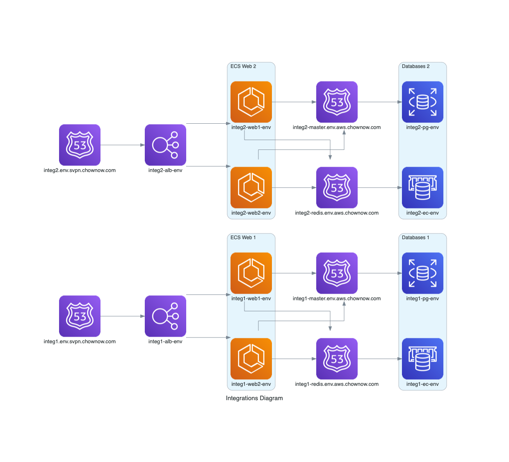

# Integrations

### General

* Description: Integrations API Terraform Module
* Created By: Tim Ho
* Module Dependencies: `vpc`, `lambda-layer`
* Provider Dependencies: `aws`, `template`




These modules must be deployed in a specific order:
1. integrations/shared (once per environment)
2. integrations/base   (once per module instance)
3. integrations/app    (once per module instance)

The `app` and `base` modules have a 1-to-1 relationship, and many module instances can be deployed per environment. This allows for multiple integrations-api branches to be deployed in a single environment, each with their own ECS/ALB resources. Resources are generally kept distinct by suffixing the service_id to the service.
Eg.
    var.service    = "integrations"
    var.service_id = "-main"
    local.service  = "integrations-main"

    * The exceptions to this rule are the Postgres DB/username due to naming constraints with Postgres. In this case, var.service will be used as the value for the Postgres DB/username.

The `shared` module has a 1-to-many relationship with `app/base` and contains resources that are shared between multiple module instances (ie Hermosa API key, Sentry DSN, New Relic License Key). Shared secrets are saved under `${var.env}/shared-${var.service}`, thus Fargate execution IAM roles created in `app` grant read access to `${var.env}/shared-${var.service}/*`.


### Usage

* Terraform basic:

```hcl
module "shared" {
  source = "git::git@github.com:ChowNow/ops-tf-modules.git//modules/chownow/services/integrations/shared?ref=cn-integrations-shared-v2.0.0"

  env = var.env
}

module "integrations_base" {
  source = "git::git@github.com:ChowNow/ops-tf-modules.git//modules/chownow/services/integrations/base?ref=cn-integrations-base-v2.1.0"

  env     = var.env
  service = var.service
}

module "integrations_app_main" {
  source = "git::git@github.com:ChowNow/ops-tf-modules.git//modules/chownow/services/integrations/app?ref=cn-integrations-app-v2.1.0"

  env             = var.env
}
```

* Terraform basic additional:

```hcl
module "integrations_app_addtl1" {
  source = "git::git@github.com:ChowNow/ops-tf-modules.git//modules/chownow/services/integrations/app?ref=cn-integrations-app-v2.1.0"

  env                    = "${var.env}"
  service_id             = "-addtl1"
}
```

* NOTE: As previously mentioned, the `app/base` modules can be deployed multiple times per environment so long as subsequent modules provide a unique `service_id` argument.

eg directory structure

```
uat
├── env_global.tf
├── global
└── us-east-1
    └── services
        └── integrations
            ├── main                   => module_instance_1
            │   ├── app
            │   │   ├── app.tf
            │   │   ├── provider.tf
            │   │   └── variables.tf
            │   └── base
            │       ├── base.tf
            │       ├── provider.tf
            │       └── variables.tf
            ├── addtl                  => module_instance_2
            │   ├── app
            │   │   ├── app.tf
            │   │   ├── provider.tf
            │   │   └── variables.tf
            │   └── base
            │       ├── base.tf
            │       ├── provider.tf
            │       └── variables.tf
            └── shared
                ├── provider.tf
                ├── shared.tf
                └── variables.tf
```


### Initialization

### Terraform


1. Run the Integrations `shared` module to create shared resources

    * `shared.tf`
    ```hcl
    module "shared" {
        source = "git::git@github.com:ChowNow/ops-tf-modules.git//modules/chownow/services/integrations/shared?ref=cn-integrations-shared-v2.0.0"

        env = var.env
    }
    ```

2. Fill pre-populated Secrets Manager secrets with proper values (created in Step 1)

3. Run the Integrations `base` module to create base resources for your specific module instance
    * `base.tf`
    ```hcl
    module "base" {
        source = "git::git@github.com:ChowNow/ops-tf-modules.git//modules/chownow/services/integrations/base?ref=cn-integrations-base-v2.0.0"

        env        = var.env
        service_id = var.service_id
    }
    ```

4. Run the Integrations `app` module to create app resources for your specific module instance
    * `app.tf`
    ```hcl
    module "app" {
        source = "git::git@github.com:ChowNow/ops-tf-modules.git//modules/chownow/services/integrations/app?ref=cn-integrations-app-v2.0.0"

        env        = var.env
        service_id = var.service_id

        hermosa_api_url = var.hermosa_api_url
    }
    ```
5. Create Postgres DB/User
    * Use `manage` task to launch db-init script
    ```bash
    ID=integrations ENV=uat && aws-vault exec $ENV -- aws ecs run-task --task-definition ${ID}-manage-${ENV} \
        --cluster ${ID}-${ENV} --launch-type FARGATE \
        --overrides '{"containerOverrides":[{ "name":"<local.service>-manage-<local.env>", "command":["bash", "/code/src/db-init.sh"] }]}' --network-configuration 'awsvpcConfiguration={subnets=[subnet-xxxxxxxxxxxxx]}'
    ```
    * The `${local.service}-manage-${local.env}` task-definition is the `manage` Dockerfile target.

6. Apply Database Schemas
    * Use `manage` task to launch migrate command
    ```bash
    ID='integrations' ENV=uat && aws-vault exec $ENV -- aws ecs run-task --task-definition ${ID}-manage-${ENV} \
        --cluster ${ID}-${ENV} --launch-type FARGATE \
        --overrides '{"containerOverrides":[{ "name":"<local.service>-manage-<local.env>", "command":["python", "manage.py", "migrate"] }]}' --network-configuration 'awsvpcConfiguration={subnets=[subnet-xxxxxxxxxxxxx]}'

7. Create Admin User
    * Use `manage` task to launch loaddata command
    ```bash
    ID='integrations' ENV=uat && aws-vault exec $ENV -- aws ecs run-task --task-definition ${ID}-manage-${ENV} \
        --cluster ${ID}-${ENV} --launch-type FARGATE \
        --overrides '{"containerOverrides":[{ "name":"integrations-uat-manage", "command":["python", "manage.py", "loaddata", "user.json"] }]}' --network-configuration 'awsvpcConfiguration={subnets=[subnet-xxxxxxxxxxxxx]}'
    ```

* If creating a new module instance (eg. addtl2), follow steps 3-7 passing a unique service_id argument to each module invocation.


### Options

* Description: Input variable options and Outputs for other modules to consume

#### Inputs

| Variable Name          | Description                   | Options                         |  Type  | Required? | Notes |
| :--------------------- | :---------------------------- | :------------------------------ | :----: | :-------: | :---- |
| env                    | unique environment/stage name | sandbox/dev/qa/uat/stg/prod/etc | string |    Yes    | N/A   |
| hermosa_api_url        | hermosa api url               | default: ''                     | string |    No     | N/A   |
| service                | name of ECS service           | default: integrations           | string |    No     | N/A   |
| service_id             | unique service id             | default: ''                     | string |    No     | N/A   |
| wildcard_domain_prefix | cert domain prefix            | default: ''                     | string |    No     | N/A   |

#### Outputs

| Variable Name | Description | Type  | Notes |
| :------------ | :---------- | :---: | :---- |
