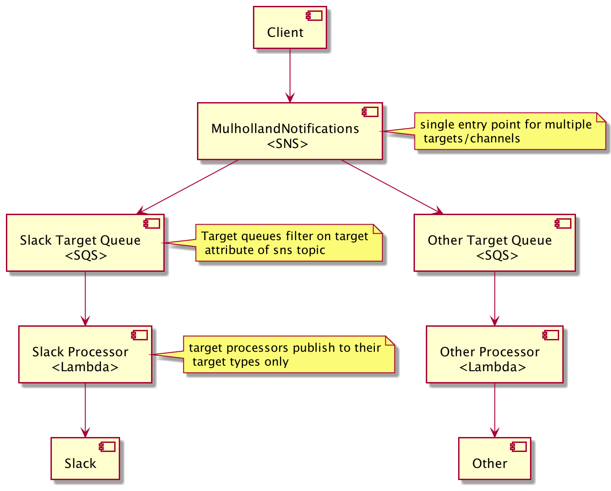

# Mulholland Notifications

### General

* Description: A module to handle a variety of Mulholland Notification types
* Created By: Keith Erickson
* Provider Dependencies: `aws`
* Terraform Version: 0.14.x


### Usage

* Terraform:

* Mulholland Notifications Base Example (`mulholland_notifications_base.tf`):
```hcl
module "mulholland_notifications_base" {
  source = "git::git@github.com:ChowNow/ops-tf-modules.git//modules/chownow/services/mulholland-notifications/base?ref=mulholland-notifications-base-v2.0.2"

  env      = var.env
  env_inst = var.env_inst
  service  = var.service
}
```

* Mulholland Notifications App Example (`mulholland_notifications_app.tf`):
```hcl
module "mulholland_notifications_app" {
  source = "git::git@github.com:ChowNow/ops-tf-modules.git//modules/chownow/services/mulholland-notifications/app?ref=mulholland-notifications-app-v2.0.1"

  env                                   = var.env
  env_inst                              = var.env_inst
  service                               = var.service
  mul_notifications_slack_image_uri     = "${var.aws_account_id}.dkr.ecr.us-east-1.amazonaws.com/mulholland-notifications-slack:kbe-initial-poc-bb5f5a8"

}
```
_Note: be sure to update the `mul_notifications_slack_image_uri` tag with a valid tag, otherwise the lambda creation will fail_

### Initialization

Example directory structure:
```
└── us-east-1
    ├── base
    ├── core
    ├── db
    └── services
        └── mulholland-notifications
            ├── app
            │   ├── mulholland_notifications_app.tf
            │   ├── provider.tf
            │   └── variables.tf
            └── base
                ├── mulholland_notifications_base.tf
                ├── provider.tf
                └── variable.tf
```

### Deployment Notes

### Current Module architecture


