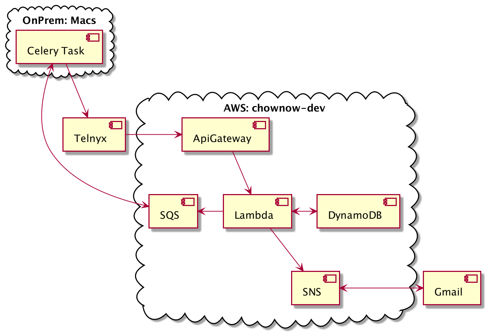

# Mulholland App Builder Pipeline Resources

### General

* Description: A module to create Mulholland app builder pipeline resources
* Created By: Keith Erickson
* Provider Dependencies: `aws`
* Terraform Version: 0.14.x


### Usage

* Terraform:

* Mulholland Base Example (`mulholland_base.tf`):
```hcl
module "mulholland_base" {
  source = "git::git@github.com:ChowNow/ops-tf-modules.git//modules/chownow/services/mulholland/base?ref=mulholland-base-v2.0.4"

  env      = var.env
  env_inst = var.env_inst
  service  = var.service
}
```

* Mulholland App Example (`mulholland_app.tf`):
```hcl
module "mulholland_app" {
  source = "git::git@github.com:ChowNow/ops-tf-modules.git//modules/chownow/services/mulholland/app?ref=mulholland-app-v2.0.4"

  env                   = var.env
  env_inst              = var.env_inst
  service               = var.service
  mul_2fa_image_uri     = "${var.aws_account_id}.dkr.ecr.us-east-1.amazonaws.com/mulholland-2fa:kbe-mul557-tf-191d758"

}
```
_Note: be sure to update the `mul_2fa_image_uri` tag with a valid tag, otherwise the lambda creation will fail_

### Initialization

Example directory structure:
```
└── us-east-1
    ├── base
    ├── core
    ├── db
    └── services
        └── mulholland
            ├── app
            │   ├── mulholland_app.tf
            │   ├── provider.tf
            │   └── variables.tf
            └── base
                ├── dynamodb_items.tf
                ├── mulholland_base.tf
                ├── provider.tf
                └── variable.tf
```

### Deployment Notes

* Currently this module is only setup to run in the `chownow-dev` account. There are follow up stories to enable it  
to move through the upper envs.
* The [sms_receiver repo](https://github.com/ChowNow/sms_receiver) has a `github` action on each push to create a new 
image and upload it to the ecr created in Terraform. Currently a manual image update is needed on the lambda for  
changes to take effect.  There is a follow up story to create a Jenkins job for this.
* There is an SNS subscription via email sent out as part of this deploy that will have to be accepted  
when deploying to new environments.

### Current Module architecture


