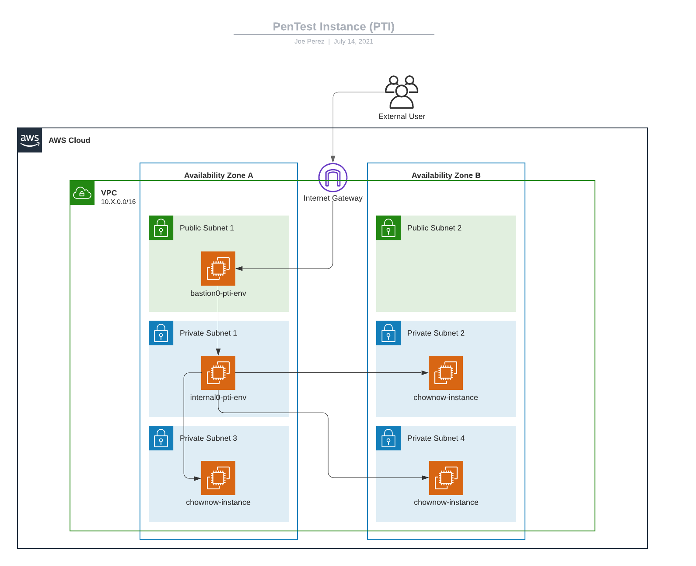

# PenTest Instance Base


### General

* Description:  A module which creates a bastion instance and internal instance for pentesting
* Created By: Joe Perez
* Module Dependencies: `core-base`
* Module Components:
  * `bastion instance (VPC Public Subnet)`
  * `internal instance (VPC Private Subnet)`
* Providers : `aws 5.x`
* Terraform Version: 1.5.x





### Usage

* Terraform:


```hcl
module "pti_base" {
  source = "git::git@github.com:ChowNow/ops-tf-modules.git//modules/chownow/services/ops/tools/pti/base?ref=chownow-pti-base-v3.0.0"

  env                 = var.env
  vpc_name            = var.env
  ingress_cidr_blocks = ["1.2.3.4/32"] # Allowed public IPs through bastion
  public_key          = file("key.pub") # External user's public key
  security_group_ids  = ["sg-123456789"] # list of security groups to allow
}

output "bastion_public_ip" {
  value = module.pti_base.bastion_public_ip
}

output "internal_private_ip" {
  value = module.pti_base.internal_private_ip
}
```

### Initialization

### Terraform

* Run the PTI base module in `base` folder
* Example directory structure:
```
.
├── global
└── us-east-1
    ├── core
    ├── db
    └── services
        └── ops
            └── tools
                └── pti
                    └── base
                        ├── env_global.tf -> ../../../../../../env_global.tf
                        ├── key.pub
                        ├── provider.tf
                        └── pti_base.tf
```

#### SSHConfig

* Add this to your sshconfig:

```
Host chownow-bastion-pti-VPCNAME
  HostName PUBLICIPOFBASTION
  User ec2-user
  IdentityFile ~/.ssh/PRIVATESSHKEYNAME

Host chownow-internal-pti-VPCNAME
  HostName PRIVATEIPOFINTERNALINSTANCE
  User kali
  IdentityFile ~/.ssh/PRIVATESSHKEYNAME
  ProxyCommand ssh -q -W %h:%p chownow-bastion-pti-VPCNAME
```
_Note: Replace the uppercase blobs with actual IP Addresses, Private SSH keys and VPC Names._

* SSH: `ssh chownow-internal-pti-ENV`
_Note: Replace `ENV` with the actual environment name set in the ssh config_


### Options

* Description: Input variable options and Outputs for other modules to consume

#### Inputs

| Variable Name       | Description                                            | Options                      |  Type  | Required? | Notes |
| :------------------ | :----------------------------------------------------- | :--------------------------- | :----: | :-------: | :---- |
| env                 | unique environment/stage name                          | dev/qa/prod/stg/uat/data     | string |    Yes    | N/A   |
| env_inst            | iteration of environment                               | eg 00,01,02,etc              | string |    No     | N/A   |
| vpc_name            | vpc name override                                      | any VPC name in environment  | string |    No     | N/A   |
| ingress_cidr_blocks | Allowed Public IP list of external user                | list of IPs in CIDR notation |  list  |    Yes    | N/A   |
| public_key          | Public SSH Key of external user                        | key file                     | string |    Yes    | N/A   |
| security_group_ids  | list of security groups to allow for internal instance | list of security group IDs   | string |    No     | N/A   |
| service             | service name                                           | pti                          | string |    No     | N/A   |


#### Outputs

| Variable Name     | Description                                 | Type  | Notes |
| :---------------- | :------------------------------------------ | :---: | :---- |
| bastion_public_ip | IPv4 public IP address for bastion instance | list  | N/A   |


### Lessons Learned

* In any new environment, you will need to go to the marketplace and subscribe to the kali linux subscription to get the official AMI.
* Even if you supply a public key/key pair to a kali instance, you can login with the default username/password :facepalm:. This is another reason why I put an amazon linux 2 bastion in front of it


### References

* [Kali on AWS](https://www.kali.org/docs/cloud/aws/)
