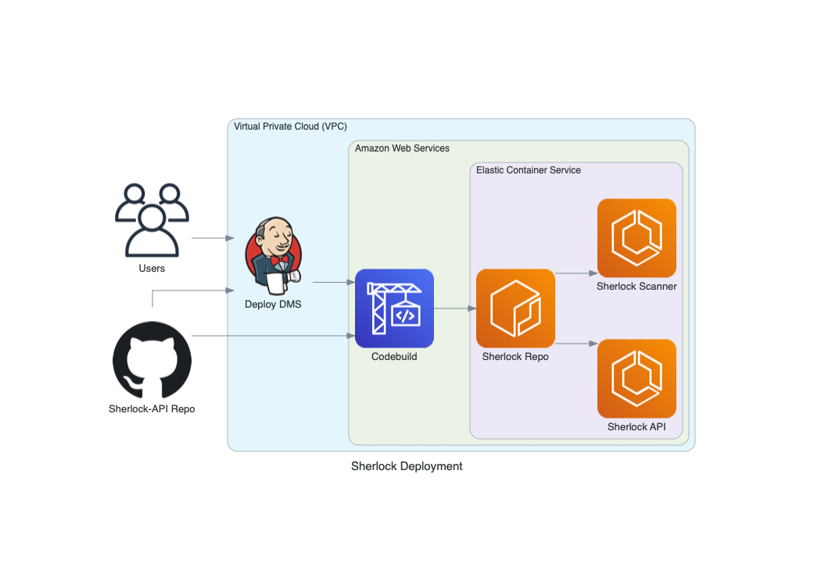

# Sherlock

### General

* Description: Sherlock V2 Terraform Module
* Created By: Allen Dantes
* Module Dependencies: `vpc`, `sherlock-base`, `lambda-layer`
* Provider Dependencies: `aws`, `template`

#### Sherlock Architecture


### Sherlock Deployment



### Terraform

* Run the Sherlock `base` module to create the secrets
```
pde-stg/
├── global
└── us-east-1
    ├── core
    ├── db
    └── services
        └── sherlock
            ├── app
            └── base
                ├── sherlock_base.tf
                ├── backend.tf
                └── variables.tf
```

  * `sherlock_base.tf`
```hcl
module "sherlock_base" {
  source = "git::git@github.com:ChowNow/ops-tf-modules.git//chownow/services/sherlock/base?ref=sherlock-base-v1.0.0"

  env = "${var.env}"
}
```

* Update the API keys and secrets in AWS Secrets Manager and store them in 1PW
* Run the db modules to create redis instance and postgresql database (RDS)
  * eg directory structure

```
pde-stg/
├── global
└── us-east-1
    ├── core
    └── db
        └── sherlock
            ├── sherlock_dynamodb.tf
            ├── sherlock_redis.tf
            ├── backend.tf
            └── env_global.tf

```

  * `sherlock_db.tf`

```hcl
module "sherlock_db" {
  source = "git::git@github.com:ChowNow/ops-tf-modules.git//aws/dynamodb/?ref=dynamodb-v1.0.0"

  name            = "${var.service}-dynamodb-${var.env}"
  env             = "${var.env}"
  hash_key        = "${var.hashkey}"
  service         = "${var.service}"
  attribute_list = [
    {
      name  = "${var.name}"
      type  = "${var.type}"
    },
  ]
}
```
* `sherlock_redis.tf`

```hcl
module "sherlock_db_redis" {
  source = "git::git@github.com:ChowNow/ops-tf-modules.git//aws/elasticache/redis?ref=elasticache-redis-v1.2.1"

  authtoken_secret_name            = "${var.env}/${var.service}/redis_auth_token"
  ec_rg_automatic_failover_enabled = false
  ec_rg_number_cache_clusters      = 1
  ec_rg_node_type                  = "cache.t3.small"
  env                              = "${var.env}"
  service                          = "${var.service}"
  vpc_name_prefix                  = "${var.vpc_name_prefix}"
}
```

* Run the Sherlock app module to create ECS/ECR/ALB/etc
  * eg directory structure

```hcl
pde-stg/
├── global
└── us-east-1
    ├── core
    ├── db
    └── services
        └── sherlock
            └── app
                ├── sherlock_app.tf
                ├── provider.tf
                └── variables.tf
```
* `sherlock_app.tf`

```hcl
module "sherlock_app" {
  source = "git::git@github.com:ChowNow/ops-tf-modules.git//chownow/services/sherlock/app?ref=sherlock-app-v1.0.0"

  env                    = "${var.env}"
}
```


### Options

* Description: Input variable options and Outputs for other modules to consume

#### Inputs

| Variable Name              | Description                            | Options                         | Type     | Required? | Notes |
| :------------------------- | :------------------------------------- | :------------------------------ | :------: | :-------: | :---- |
| container_port             | ECS container port                     | TCP port                        | string   |  No       | N/A   |
| env                        | unique environment/stage name          | pde-stg pde-prod                | string   |  Yes      | N/A   |
| service                    | name of ECS service                    | default: sherlock               | string   |  No       | N/A   |
| app_dashboard_url          | Whitelist App-dashboard CORS           | default: ""                     | string   |  No       | N/A   |


#### Outputs


### Lessons Learned


### References
